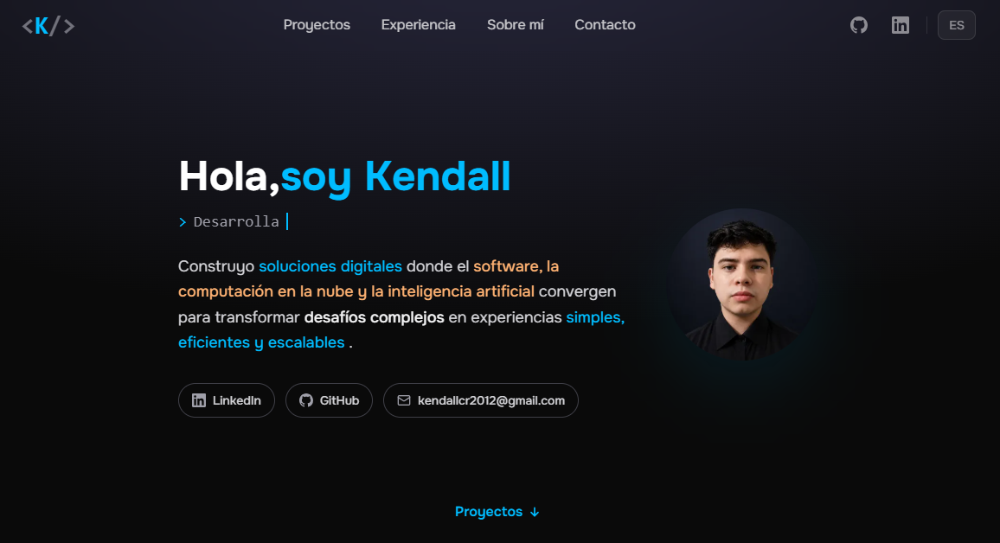

<div align="center">

# <K/> Kendall Calderón - Portfolio

### Personal developer portfolio focused on Software Development, Cloud Computing & Applied AI

A modern, responsive portfolio built to showcase my **projects, professional experience, technical background, and career journey**.

<br>

[](https://www.kendallc.dev/)
[](https://www.linkedin.com/in/kendallcal/)
[](https://github.com/KendallCal)

<br>



</div>

---

## 👨‍💻 About

This repository contains the source code for my personal portfolio, **[kendallc.dev](https://www.kendallc.dev/)**.

The website was designed and developed as a central place to present who I am as a technology professional, the projects I build, the experience I have gained, and the areas in which I continue growing.

My main professional interests are:

**Software Development · Cloud Computing · Applied Artificial Intelligence**

---

## ✨ Features

* 🌎 **Bilingual experience** — Spanish and English.
* 💼 Professional experience and background.
* 🚀 Dedicated project showcase and project detail pages.
* 👨‍💻 About and professional profile sections.
* 🛠️ Interactive technology stack presentation.
* 📄 Downloadable CV.
* 📬 Dedicated contact page.
* 📱 Responsive navigation and layout.
* ✨ Smooth section reveal animations.
* ♿ Reduced-motion support for improved accessibility.
* 🔗 Integrated GitHub and LinkedIn navigation.

---

## 🛠️ Tech Stack

<div align="center">


</div>

| Area                 | Technology          |
| -------------------- | ------------------- |
| Framework            | Astro 7             |
| Styling              | Tailwind CSS 4      |
| Language             | JavaScript / Astro  |
| Typography           | Onest Variable      |
| Image Processing     | Sharp               |
| Runtime              | Node.js             |
| Internationalization | Astro i18n          |
| Testing              | Node.js Test Runner |

---

## 🧩 Website Structure

```text
src/
├── assets/
├── components/
│   ├── projects/
│   ├── AboutMe.astro
│   ├── Experience.astro
│   ├── Header.astro
│   ├── Hero.astro
│   └── Stack.astro
├── data/
├── i18n/
├── layouts/
├── pages/
│   ├── en/
│   ├── projects/
│   ├── about.astro
│   ├── contact.astro
│   └── index.astro
└── styles/
```

The project follows a component-based structure to keep presentation, content, localization, and project data organized and maintainable.

---

## 🌎 Internationalization

The portfolio supports two languages:

* 🇨🇷 **Spanish** — default language.
* 🇺🇸 **English** — available under localized routes.

The language system is integrated into navigation, metadata, pages, and reusable components.

---

## 🎨 Design Approach

The portfolio was created around a few principles:

> **Simple enough to navigate quickly.
> Detailed enough to communicate technical value.
> Personal enough to feel like my own work.**

The visual direction combines a minimal dark interface, subtle animations, clear typography, and a strong focus on projects and professional information.

---

## 🚀 Run Locally

### 1. Clone the repository

```bash
git clone https://github.com/KendallCal/portfolio.git
```

### 2. Enter the project

```bash
cd portfolio
```

### 3. Install dependencies

```bash
npm install
```

### 4. Start the development server

```bash
npm run dev
```

The project will be available through the local Astro development server.

---

## 🧪 Available Commands

| Command           | Description                                 |
| ----------------- | ------------------------------------------- |
| `npm run dev`     | Starts the development server               |
| `npm run build`   | Creates the production build                |
| `npm run preview` | Previews the production build               |
| `npm test`        | Builds the project and runs automated tests |

---

## 🌐 Live Website

<div align="center">

### [www.kendallc.dev](https://www.kendallc.dev/)

Explore my projects, experience, technologies, and professional profile.

<br>

[](https://www.kendallc.dev/)

</div>

---

<div align="center">

### 👨‍💻 Kendall Calderón

**Software Development · Cloud Computing · Applied AI**

[](https://www.linkedin.com/in/kendallcal/)
[](https://github.com/KendallCal)
[](https://www.kendallc.dev/)

</div>
